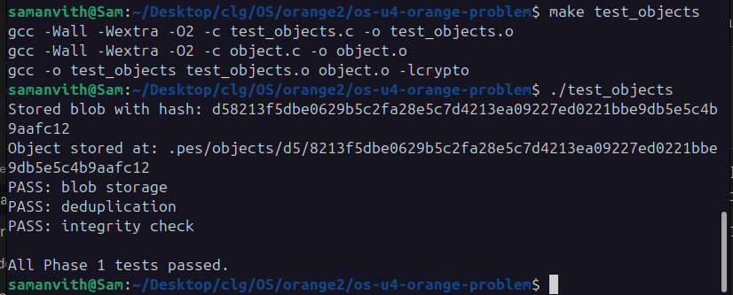
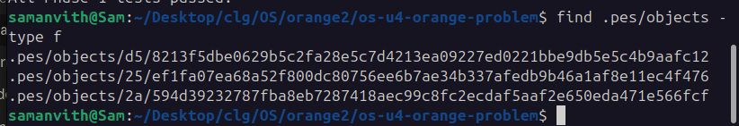
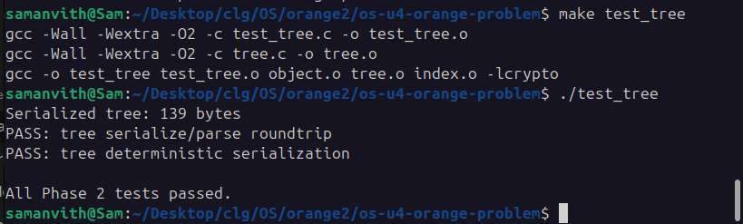
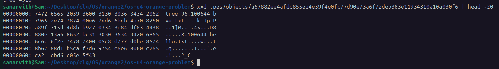
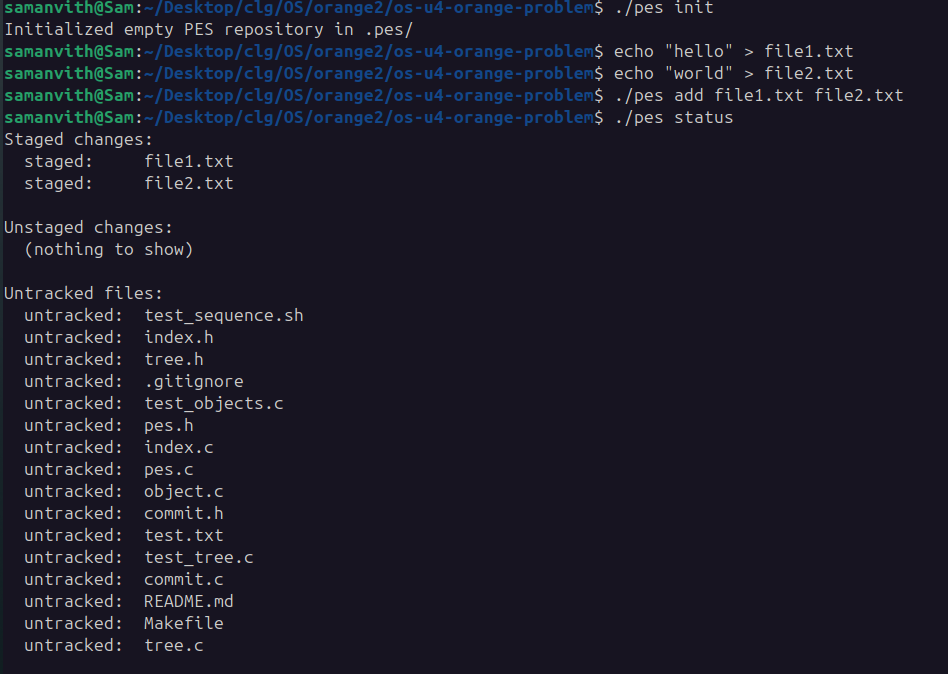
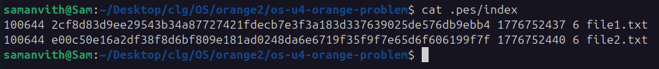
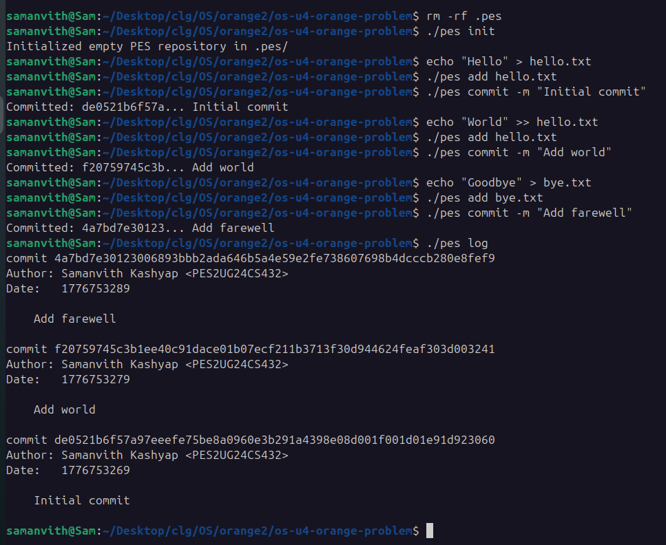
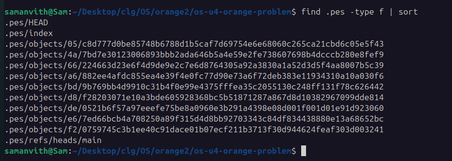
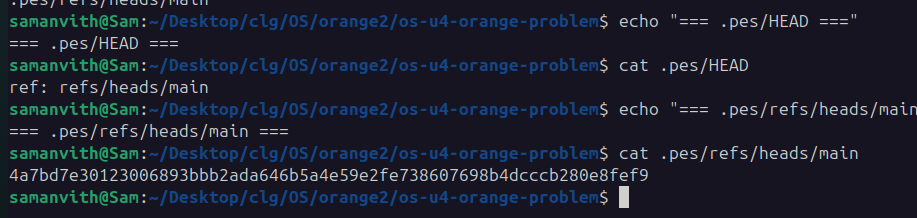
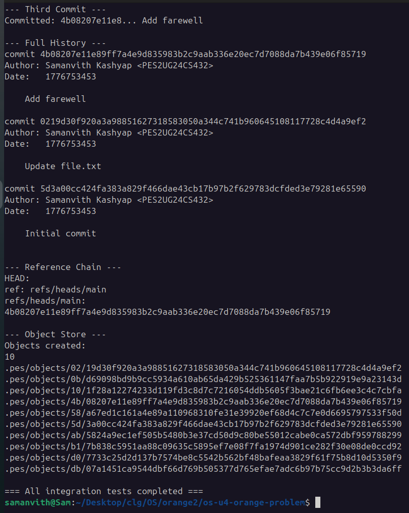

# PES-VCS Lab Report

**Name:** Samanvith Kashyap  
**SRN:** PES2UG24CS432  
**Section:** G  
**Repository:** <https://github.com/samanvithkashyap/PES2UG24CS432-PES-VCS>

\hrulefill

## Phase 1

**Screenshot 1A:**

{width=90%}

**Screenshot 1B:**

{width=90%}

\newpage

## Phase 2

**Screenshot 2A:**

{width=90%}

**Screenshot 2B:**

{width=90%}

\newpage

## Phase 3

**Screenshot 3A:**

{width=90%}

**Screenshot 3B:**

{width=90%}

\newpage

## Phase 4

**Screenshot 4A:**

{width=90%}

\newpage

**Screenshot 4B:**

{width=90%}

**Screenshot 4C:**

{width=90%}

\newpage

**Integration test:**

{width=90%}

\newpage

## Phase 5

**Q5.1**

To implement `pes checkout <branch>`, `.pes/HEAD` is rewritten to contain `ref: refs/heads/<branch>`, and `.pes/index` is rebuilt to match the target branch's tree. The working directory must be updated: files in the target tree are written out, files only in the current tree are deleted, and unchanged files are left alone. It's complex because it's not atomic — writing many files can fail midway, leaving the working directory inconsistent. It must also detect uncommitted changes before starting to avoid destroying user work, and handle edge cases like case-insensitive filesystems, symlinks, and paths that change from file to directory between branches.

**Q5.2**

For each entry in the index, `stat()` the path. If `mtime` and `size` match the index values, the file is unchanged. Otherwise, read the file, compute its blob hash, and compare against the index entry's hash. If the hash differs, the file is dirty. Checkout must refuse when a dirty file has a different hash in the target branch's tree than in the index, because switching would overwrite the uncommitted change.

**Q5.3**

In detached HEAD, `.pes/HEAD` contains a commit hash directly instead of `ref: refs/heads/<name>`. Commits made in this state update HEAD to point at the new commit, but no branch references it. Switching to any branch moves HEAD and leaves the new commits orphaned — reachable by nothing, eligible for garbage collection. To recover, note the current HEAD hash before switching (`cat .pes/HEAD`), then after switching, create a new branch pointing at that hash by writing it into `.pes/refs/heads/<recovery-branch>`.

\newpage

## Phase 6

**Q6.1**

Use mark-and-sweep. Start with all branch tips in `.pes/refs/heads/` plus HEAD. For each commit, mark its tree and parent reachable; for each tree, mark its blobs and subtrees reachable. Repeat until nothing new is added. Use a hash set of object IDs for O(1) lookup. Then walk `.pes/objects/` and delete any file whose hash isn't in the set. For 100,000 commits × 50 branches, deduplication means shared objects aren't re-counted — you'd visit roughly 700,000 objects total (100,000 commits plus a few new trees and blobs per commit), not 100,000 × 50.

**Q6.2**

A `commit` operation writes tree and blob objects before writing the commit object that references them. If GC runs in that window, those new trees and blobs aren't yet reachable from any ref, so GC marks them unreachable and deletes them. The commit then finishes and writes a commit object pointing to deleted trees — the repo is corrupted. Git avoids this by only pruning objects older than a grace period (default two weeks), so freshly written loose objects are always safe. It also uses locks and reflog entries as additional reachability roots.